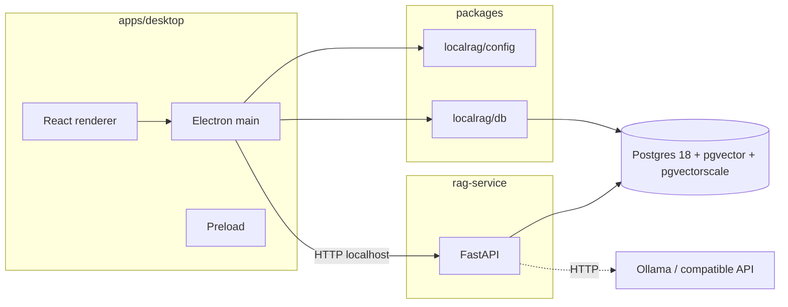

# LocalRAG Studio

A **desktop app** for working with your own documents using retrieval-augmented generation: ingest files, store **embeddings in PostgreSQL** (**pgvector** types + **pgvectorscale** StreamingDiskANN / cosine search), and chat with answers **grounded in sources** and **`[#n]` citations**. Supports **Ollama** locally and **OpenAI-compatible** HTTP APIs. **RAG** (ingest, embeddings, retrieval, chat) runs in a local **Python FastAPI** service; **Electron** drives the UI, settings, and DB migrations via **TypeScript** (`@localrag/db`, `@localrag/config`).

---

## Overview

| | |
| :--- | :--- |
| **Scope** | Full pipeline: ingest → chunk → embed → vector index → retrieve → LLM answer with citations; document library and settings in a native desktop shell |
| **Implementation** | SQL migrations in TS, **Zod** settings, **Python** `rag-service` (FastAPI + **pytest**), **Vitest** in legacy TS packages, **pnpm** workspace |
| **Stack** | Node **24+**, TypeScript, pnpm **10**, Electron **41**, React **19**, **Drizzle** (migrate + document list/delete), **Python 3.14**, **Postgres 18** + **pgvector** + **pgvectorscale** |

---

## Engineering

- **Monorepo layout** — [`rag-service`](rag-service) (Python RAG API), `apps/desktop`, `packages/config`, `packages/db`. Legacy TS packages `core` / `ingestion` / `llm` remain for reference/tests but are not used by the desktop app.
- **Database** — Versioned migrations in [`packages/db/migrations`](packages/db/migrations); parameterized access via `pg`; **StreamingDiskANN** (`pgvectorscale`) on `vector(768)`; `ingestion_events` / `query_events` as ordinary tables.
- **Desktop hardening** — **Context isolation**, a small preload surface, and **Zod**-checked payloads on IPC handlers in the main process.
- **Runtime & deploy** — Custom [**Dockerfile**](docker/db/Dockerfile) for Postgres 18 + pgvector + pgvectorscale; Compose healthchecks; Postgres exposed on host **5433** by default; [.devcontainer](.devcontainer) tracks **Node 24**.
- **Dependencies** — Root **`engines`**, **`pnpm.engineStrict`**, pinned **`packageManager`**, and **`onlyBuiltDependencies`** for `electron` / `esbuild` under pnpm 10’s lifecycle-script defaults.

---

## Capabilities

- **Ingest** — txt / md / json / pdf; content-hash **dedupe**; configurable chunking; transactional per-document chunk replace.
- **Embed & search** — Shared embedding path for ingest and query; dimension checks vs settings; **topK** clamped in code; **cosine** ordering via `<=>`.
- **Answer** — Context-only system prompt; **`[#n]`** citations; parser handles common multi-ref formats; citations mapped back to stored chunks.
- **Desktop** — Document library + chat UI; settings for provider URLs/models; keys for HTTP providers handled in main (not baked into renderer).

---

## Architecture

**Flow:** ingest → parse → chunk → embed → write chunks · query → embed question → vector search → prompt → complete → citations.

---

## Technical reference

| Area | Details |
|------|---------|
| **Vectors** | `vector(768) NOT NULL` (pgvector), **StreamingDiskANN** (`diskann`, `vector_cosine_ops` via pgvectorscale), cosine distance in SQL (queries from **rag-service**) |
| **RAG** | Implemented in **rag-service**; numbered context block; citation parse for `[#n]` and comma lists like `[#2, #5]`; fallback when the model omits cites |
| **Telemetry** | `ingestion_events`, `query_events` (ingest + query latency, retrieved chunk IDs, etc.) |
| **Config** | `@localrag/config` (Electron); Pydantic mirrors settings in **rag-service** |
| **Tooling** | `pnpm` build/test/lint; `pytest` in **rag-service**; production desktop builds via **electron-vite** |

---

## Quick start

### Before you start

You should have **Docker Desktop** installed. Work from the **repository root** (where `package.json` and `docker-compose.yml` live). The default database URL uses host port **5433** — see [.env.example](.env.example) if you change Compose ports.

### First run

**Windows**

1. **`setup.bat`** — Full clean setup: new `.env` from `.env.example`, database via Compose (this project’s Compose volume is reset), **Node 24+** and **Python 3.14** via **winget** if needed, [`rag-service`](rag-service) `pip install`, `pnpm install`, package builds, migrations. First run may take a while.
2. **`run.bat`** — Start the desktop app.

**macOS / Linux**

From the repo root (make scripts executable once: `chmod +x setup.sh run.sh migrate.sh`):

1. **`./setup.sh`** — Same role as **`setup.bat`**: clean `.env`, reset this project’s Compose volume, start Postgres, [`rag-service`](rag-service) `pip install`, `pnpm install`, builds, migrations. With **[Homebrew](https://brew.sh)** (macOS or Linux), missing **Node 24+** or **Python 3.14** are installed via **`brew`** when possible. Otherwise install those runtimes yourself, then run **`./setup.sh`**.
2. **`./run.sh`** — Start the desktop app (like **`run.bat`**).

**Optional:** **`./migrate.sh`** — Compose up + **`pnpm db:migrate`** only (like **`migrate.bat`**).

Manual alternative if you prefer not to use the scripts: install [Node.js 24+](https://nodejs.org), **Python 3.14**, and [pnpm 10](https://pnpm.io), then `cp .env.example .env`, `docker compose up -d`, `cd rag-service && pip install -e ".[dev]" && cd ..`, `pnpm install`, `pnpm db:migrate`, `pnpm dev`.

### After that

- **Windows:** **`run.bat`** when you want to develop (with Docker available).
- **macOS / Linux:** **`./run.sh`** or **`pnpm dev`** from the repo root.

Electron starts [`rag-service`](rag-service) on **127.0.0.1:8787** unless **`LOCALRAG_RAG_PORT`** is set in `.env`; **`LOCALRAG_PYTHON`** selects the Python executable if you need it.

### Using the app

Set **Ollama** or an **OpenAI-compatible** provider in settings, add documents, then chat. Answers should use **`[#1]`**-style citations when the model cooperates.

### If something fails

- Ensure **Docker Desktop** is running.
- If **`run.bat`** / **`./run.sh`** reports missing dependencies, run **`setup.bat`** / **`./setup.sh`** again or **`pnpm install`**.
- **Old local Postgres / Timescale volumes:** you may need `docker compose down -v` and a fresh `docker compose up -d`, or see [docker/db/Dockerfile](docker/db/Dockerfile) and migration `003`.